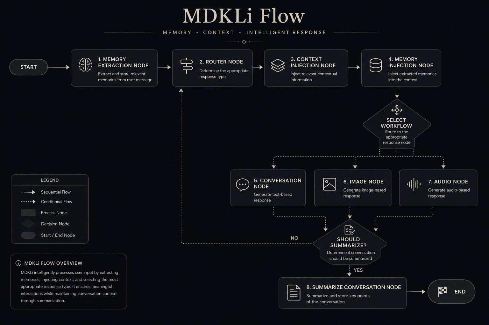

<p align="center">
<h1 align="center"> MDKLi </h1>
</p>
<p align="center">
  
</p>
<p align="center">
  
  
</p>

<p align="center">
An AI Companion built with <b>LangGraph</b>, <b>Chainlit</b>, <b>Groq</b>, and <b>Qdrant</b>.
</p>

<p align="center">


</p>

---

# Features

- AI Chat Assistant
- Long-Term Memory (Qdrant)
- LangGraph Workflow
- Chainlit User Interface
- Voice Support (ElevenLabs)
- Image Understanding
- FastAPI Backend
- WhatsApp Integration (Optional)

---

# Tech Stack

| Technology | Purpose |
|------------|----------|
| Python | Backend |
| LangGraph | AI Workflow |
| Chainlit | Chat Interface |
| Groq | LLM Provider |
| Qdrant | Vector Database |
| FastAPI | REST API |
| Docker | Infrastructure |

---

# Project Structure

```text
mdkli
│
├── src/
│   └── ai_companion/
│       ├── graph/
│       ├── interfaces/
│       ├── modules/
│       ├── tools/
│       └── settings.py
│
├── docker/
├── assets/
├── tests/
├── .env.example
├── pyproject.toml
└── README.md
```

---

# Requirements

- Python 3.12.8
- Docker Desktop
- Git
- uv

Install uv

https://docs.astral.sh/uv/getting-started/installation/

---

# Installation

## (1) Clone Repository

```bash
git clone https://github.com/yourusername/mdkli.git

cd mdkli
```

---

## (2) Create Virtual Environment

```bash
uv venv .venv
```

Activate for Windows

```powershell
.\.venv\Scripts\Activate.ps1
```

Activate for Linux / macOS

```bash
source .venv/bin/activate
```

---

## (3) Install Dependencies

```bash
uv pip install -e .
```

Verify Python

```bash
python --version
```

Expected

```text
Python 3.12.8
```

---

# (4) Configuration

Copy

```bash
cp .env.example .env
```

Windows

```powershell
Copy-Item .env.example .env
```

Update

```env
GROQ_API_KEY=

ELEVENLABS_API_KEY=
ELEVENLABS_VOICE_ID=

TOGETHER_API_KEY=

QDRANT_URL=http://localhost:6333
QDRANT_API_KEY=

WHATSAPP_PHONE_NUMBER_ID=
WHATSAPP_TOKEN=
WHATSAPP_VERIFY_TOKEN=
```

---

# (5) Running Qdrant

Start Qdrant only

```bash
docker compose up -d qdrant
```

Verify

```bash
docker ps
```

Dashboard

```
http://localhost:6333/dashboard
```

---

# (6.1) Running Chainlit

Windows

```powershell
$env:PYTHONPATH="$PWD\src"
```

Linux

```bash
export PYTHONPATH="$PWD/src"
```

Run

```bash
python -m chainlit run src/ai_companion/interfaces/chainlit/app.py --host 0.0.0.0 --port 8000
```

Open

```
http://localhost:8000
```

---
# (6.2) Running Api

Windows

```powershell
$env:PYTHONPATH="$PWD\src"
```
```powershell
cd src
```

make sure you here
```
D:\mdkli\mdkli\src>
```

run 
```
uvicorn ai_companion.interfaces.api.main:app --reload --host 0.0.0.0 --port 8000  
```
open 
```
http://localhost:8000/docs#
```

# Architecture

```text
                 User
                  │
                  ▼
          ┌───────────────┐
          │   Chainlit    │
          └──────┬────────┘
                 │
                 ▼
          ┌───────────────┐
          │   LangGraph   │
          └──────┬────────┘
                 │
     ┌───────────┼───────────┐
     ▼                       ▼
 Groq API               Qdrant
                         Memory
```

---

# Development Workflow

Start Qdrant

```bash
docker compose up -d qdrant
```

Activate venv

```bash
.\.venv\Scripts\Activate.ps1
```

Run Chainlit

```bash
python -m chainlit run src/ai_companion/interfaces/chainlit/app.py
```

---

# Useful Commands

Start Qdrant

```bash
docker compose up -d qdrant
```

Stop Containers

```bash
docker compose down
```

Container Status

```bash
docker ps
```

Logs

```bash
docker compose logs -f
```

Run Tests

```bash
pytest
```

---

# Troubleshooting

## ModuleNotFoundError

```powershell
$env:PYTHONPATH="$PWD\src"
```

---

## Qdrant Connection Error

Verify
file .env
```
QDRANT_URL=http://localhost:6333
```

---

## Invalid Groq API Key

Generate a new API Key

https://console.groq.com/

---

# Roadmap

- [x] Chat
- [x] Long-Term Memory
- [x] Voice
- [x] Image Support
- [ ] WhatsApp Integration
- [ ] Authentication
- [ ] Deployment

---

# Contributing

Contributions are welcome.

1. Fork the repository.
2. Create a feature branch.
3. Commit your changes.
4. Open a Pull Request.

---

# License

MIT License

---

<p align="center">

Made with MDKLi team using LangGraph and Chainlit.

</p>